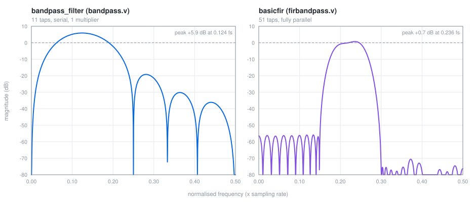

# BandPassFilter

**FIR band-pass filter using Verilog HDL** — two synthesisable digital filter
designs generated with MATLAB Filter Design HDL Coder, with a step-by-step
tutorial, self-checking test benches, and a one-command simulation.

Both are Direct-Form FIR filters with exact linear phase (Type 1, symmetric
coefficients), fixed-point arithmetic, and no vendor primitives — they
synthesise on Xilinx, Intel/Altera, Lattice, or anything else that takes
Verilog-2001.



## The two designs

| | [`bandpass.v`](bandpass.v) | [`firbandpass.v`](firbandpass.v) |
| --- | --- | --- |
| Module | `bandpass_filter` | `basicfir` |
| Taps | 11 | 51 |
| Architecture | fully serial, **1 multiplier** | fully parallel, 51 multipliers |
| Throughput | one sample per **9 clocks** | one sample per clock |
| Latency | 2 sample periods | 1 clock |
| Input | `sfix18_En17`, range [-1, 1) | `sfix8_En9`, range [-0.25, 0.25) |
| Coefficients | `sfix6_En5` | `sfix14_En15` |
| Output | `sfix33_En30`, range [-4, 4) | `sfix20_En20`, range [-0.5, 0.5) |
| Passband (-3 dB) | 0.079 – 0.171 × f<sub>s</sub> | 0.191 – 0.255 × f<sub>s</sub> |
| Peak gain | +5.9 dB at 0.124 × f<sub>s</sub> | +0.7 dB at 0.236 × f<sub>s</sub> |
| Stopband | ≈ -19 dB (11 taps is coarse) | **< -56 dB** |

`bandpass.v` trades area for speed: it folds an 11-tap filter onto a single
multiplier over 9 clock cycles, and it skips the two coefficients that are
exactly zero rather than wasting cycles on them. `firbandpass.v` spends the
multipliers and gets a far sharper response.

Both have exact zeros at DC and at Nyquist, so there is no leakage at either
end of the spectrum.

## Simulate it

Everything runs in a few seconds with [Icarus Verilog](https://bleyer.org/icarus/):

```sh
brew install icarus-verilog     # macOS   (Debian/Ubuntu: sudo apt install iverilog)
make sim
```

```
test 1: impulse response == coefficients
test 2: full-scale square wave at the passband centre
test 3: full-scale random input
test 4: worst-case sign pattern (accumulator hits 2.375)
PASS  bandpass_filter: 585 checks, 0 mismatches

test 1: impulse response == coefficients
test 2: output carries amplitude, not just sign
  distinct output values observed: 65
test 3: full-scale random input
PASS  basicfir: 704 checks, 0 mismatches
```

The test benches ([`tb_bandpass.v`](tb_bandpass.v),
[`tb_firbandpass.v`](tb_firbandpass.v)) check each design against an
independent reference model rather than against stored vectors: they verify
that the impulse response really is the coefficient set, and that the output
matches a 64-bit integer model of the filter for full-scale square, random and
worst-case stimulus.

Other targets: `make lint` (syntax and width checks), `make plot` (regenerate
the response plot above straight from the coefficients in the RTL — pure
Python, no numpy or matplotlib), `make clean`.

## Using the filters

Both modules share the same interface style:

```verilog
bandpass_filter u_filter (
    .clk        (clk),
    .clk_enable (enable),      // hold high; gates the whole datapath
    .reset      (reset),       // active high, asynchronous
    .filter_in  (sample_in),   // sfix18_En17
    .filter_out (sample_out)   // sfix33_En30
);
```

For `bandpass_filter`, present a new input sample every 9 clocks — the design
consumes one sample per folding cycle, so the effective sample rate is
f<sub>clk</sub>/9. `basicfir` consumes one sample per enabled clock.

## Tutorial

[`Instructions.pdf`](Instructions.pdf) walks through building the filter from
scratch in MATLAB — designing the response with `fdatool`/Filter Designer,
choosing the fixed-point word lengths, and generating Verilog with Filter
Design HDL Coder. You can follow it end to end without the sources here.

## Fixed since the original submission

The two designs were regenerated in 2020 straight from MATLAB with
*Filter Internals → Specify Precision*. Two of those word-length choices were
wrong, and both are fixed here — the coefficients and the architecture are
untouched.

**`firbandpass.v` — the output carried only the sign.** The generated output
format was `sfix8_En32`, a range of ±2.98e-08, fed from an `sfix20_En20`
accumulator whose range is ±0.5 — seventeen million times wider. Every
non-zero value saturated, so `data_out` was +127 or -128 and nothing else.
The output is now the accumulator itself, `sfix20_En20`, at full precision.

> The generated `firbandpass_tb.v` cannot catch this: its golden vectors were
> produced from the same specification, so they contain only `8'h7f`, `8'h80`
> and `8'h00` and the broken design passes its own test. That file is kept
> as-is for reference; `tb_firbandpass.v` is the one that actually checks the
> filter.

**`bandpass.v` — the accumulator wrapped.** It was `sfix26_En24`, range ±2,
but this filter's worst-case gain is Σ|h| = 2.375, and the generated overflow
mode was *wrap* rather than saturate. A full-scale square wave at the centre
frequency overflowed on roughly half of all samples, and because it wrapped
rather than clipped, the sample came out with its **sign inverted** — a
full-amplitude click. The accumulator is now `sfix27_En24`, range ±4, which
covers the worst case, so the datapath is exact. `filter_out` is unchanged:
`sfix33_En30` was already wide enough.

Both test benches fail on the original RTL and pass on the fixed version.

## Repository layout

| File | What it is |
| --- | --- |
| `bandpass.v` | 11-tap serial band-pass filter, module `bandpass_filter` |
| `firbandpass.v` | 51-tap parallel band-pass filter, module `basicfir` |
| `tb_bandpass.v` | self-checking test bench for `bandpass_filter` |
| `tb_firbandpass.v` | self-checking test bench for `basicfir` |
| `firbandpass_tb.v` | the original MATLAB-generated test bench for `basicfir` (see note above) |
| `tools/plot_response.py` | generates `docs/response.svg` from the RTL coefficients |
| `Instructions.pdf` | step-by-step MATLAB + HDL Coder tutorial |

## Related

A write-up of the design process:
[How to create a Finite Impulse Response (FIR) Bandpass Filter, using Verilog in MATLAB](https://medium.com/p/65559c53dd58)

## License

[MIT](LICENSE) © Muhammad Abdullah Arif Ansari
